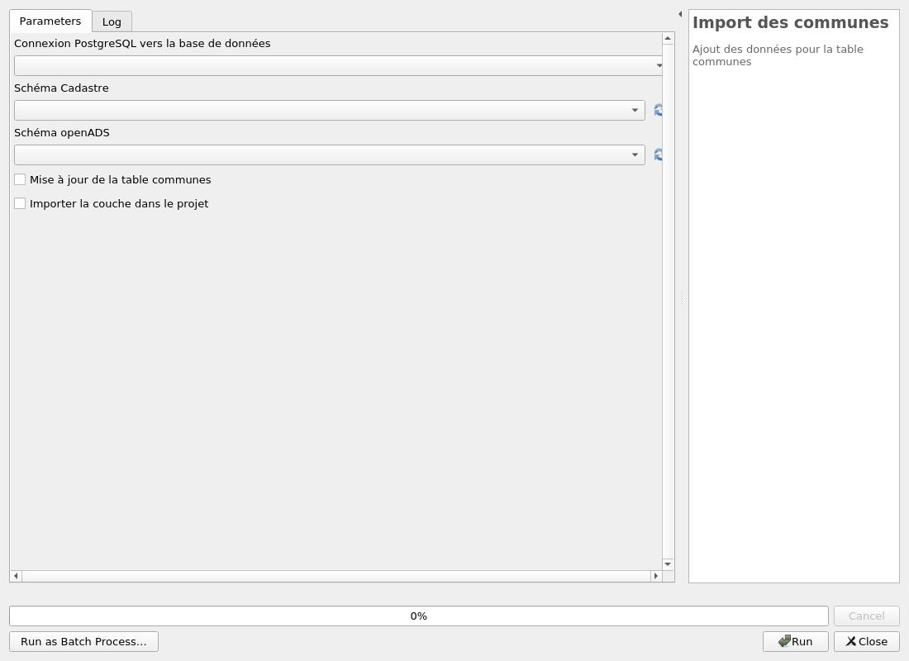

---
hide:
  - navigation
---

# Processing

## Base de données

### Installation de la base de données

Création de la structure de la base données.

#### Parameters

| ID | Description | Type | Info | Required | Advanced | Option |
|:-:|:-:|:-:|:-:|:-:|:-:|:-:|
CONNECTION_NAME|Connexion PostgreSQL vers la base de données|ProviderConnection|Nom de la connexion dans QGIS pour se connecter à la base de données|✓|||
CRS|Projection|Crs||✓||Default: EPSG:2154   |
OVERRIDE|Écraser le schéma openads ? ** ATTENTION ** Cela supprimera toutes les données !|Boolean||✓|||

#### Outputs

| ID | Description | Type | Info |
|:-:|:-:|:-:|:-:|
DATABASE_VERSION|Version de la base de données|String||

***

### Mise à jour de la base de données

Mise à jour de la structure de la base données.

#### Parameters

| ID | Description | Type | Info | Required | Advanced | Option |
|:-:|:-:|:-:|:-:|:-:|:-:|:-:|
CONNECTION_NAME|Connexion PostgreSQL vers la base de données|ProviderConnection|Nom de la connexion dans QGIS pour se connecter à la base de données|✓|||
CRS|Projection|Crs||✓||Default: EPSG:2154   |
RUN_MIGRATIONS|Cocher cette option pour lancer la mise-à-jour.|Boolean||✓|||

#### Outputs

| ID | Description | Type | Info |
|:-:|:-:|:-:|:-:|
OUTPUT_STATUS|Output status|Number||
OUTPUT_STRING|Output message|String||

***

## Import des données

### Import des communes

Ajout des données pour la table communes

#### Parameters

| ID | Description | Type | Info | Required | Advanced | Option |
|:-:|:-:|:-:|:-:|:-:|:-:|:-:|
CONNECTION_NAME|Connexion PostgreSQL vers la base de données|ProviderConnection|Base de données de destination|✓|||
SCHEMA_CADASTRE|Schéma Cadastre|DatabaseSchema|Nom du schéma des données cadastre|✓||Default: cadastre   |
SCHEMA_OPENADS|Schéma openADS|DatabaseSchema|Nom du schéma des données openADS|✓||Default: openads   |
TRUNCATE_PARCELLES|Mise à jour de la table communes|Boolean||✓|||
IMPORT_PROJECT_LAYER|Importer la couche dans le projet|Boolean||✓|||

#### Outputs

| ID | Description | Type | Info |
|:-:|:-:|:-:|:-:|
OUTPUT|Couches de sortie|MultipleLayers||
OUTPUT MSG|Message de sortie|String||

***

### Import des contraintes

Ajout des données pour les tables des contraintes

#### Parameters

| ID | Description | Type | Info | Required | Advanced | Option |
|:-:|:-:|:-:|:-:|:-:|:-:|:-:|
ENTREE|Couche en entrée pour les contraintes|FeatureSource|Couche vecteur qu'il faut importer dans la base de données|✓|||
CHAMP_ETIQUETTE|Champ des étiquettes|Field|Champ des étiquettes pour la contrainte|✓|||
CHAMP_TEXTE|Champ texte|Field|Champ texte pour la contrainte|✓|||
VALEUR_GROUPE|Valeur pour le groupe|String|Zonage, Contraintes, Servitudes, Droit de Préemption, Lotissement, ou tout autre valeur libre|✓|||
VALEUR_SOUS_GROUPE|Valeur pour le sous-groupe|String|Valeur libre||||
CONNECTION_NAME|Connexion PostgreSQL vers la base de données|ProviderConnection|Base de données de destination|✓|||
SCHEMA_OPENADS|Schéma openADS|DatabaseSchema|Nom du schéma des données openADS|✓||Default: openads   |

#### Outputs

| ID | Description | Type | Info |
|:-:|:-:|:-:|:-:|
COUNT_FEATURES|Nombre d'entités importés|Number||
COUNT_NEW_CONSTRAINTS|Nombre de nouvelles contraintes|Number||

***

### Import des parcelles

Ajout des données pour la table parcelles

#### Parameters

| ID | Description | Type | Info | Required | Advanced | Option |
|:-:|:-:|:-:|:-:|:-:|:-:|:-:|
CONNECTION_NAME|Connexion PostgreSQL vers la base de données|ProviderConnection|Base de données de destination|✓|||
SCHEMA_CADASTRE|Schéma Cadastre|DatabaseSchema|Nom du schéma des données cadastre|✓||Default: cadastre   |
SCHEMA_OPENADS|Schéma openADS|DatabaseSchema|Nom du schéma des données openADS|✓||Default: openads   |
TRUNCATE_PARCELLES|Mise à jour de la table parcelles|Boolean||✓|||
IMPORT_PROJECT_LAYER|Importer la couche dans le projet|Boolean||✓|||

#### Outputs

| ID | Description | Type | Info |
|:-:|:-:|:-:|:-:|
OUTPUT|Couches de sortie|MultipleLayers||
OUTPUT MSG|Message de sortie|String||

***

### Chargement des couches depuis la base

Charger toutes les couches de la base de données.

#### Parameters

| ID | Description | Type | Info | Required | Advanced | Option |
|:-:|:-:|:-:|:-:|:-:|:-:|:-:|
CONNECTION_NAME|Connexion PostgreSQL vers la base de données|ProviderConnection|Base de données de destination|✓|||
SCHEMA|Schéma|DatabaseSchema|Nom du schéma des données openads|✓||Default: openads   |
URL_ADS|URL du dossier OpenADS|String|L'URL du dossier OpenADS||||

#### Outputs

| ID | Description | Type | Info |
|:-:|:-:|:-:|:-:|
OUTPUT|Couches de sortie|MultipleLayers||
OUTPUT MSG|Message de sortie|String||

***
