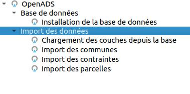
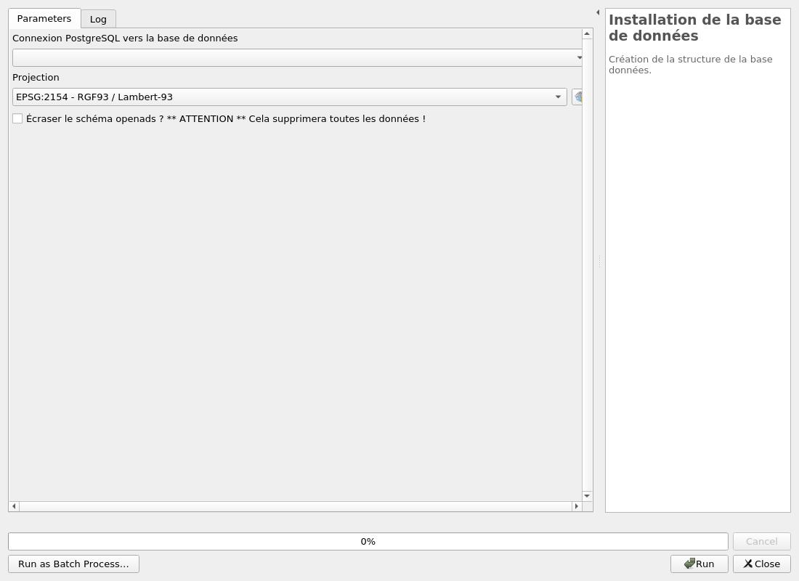
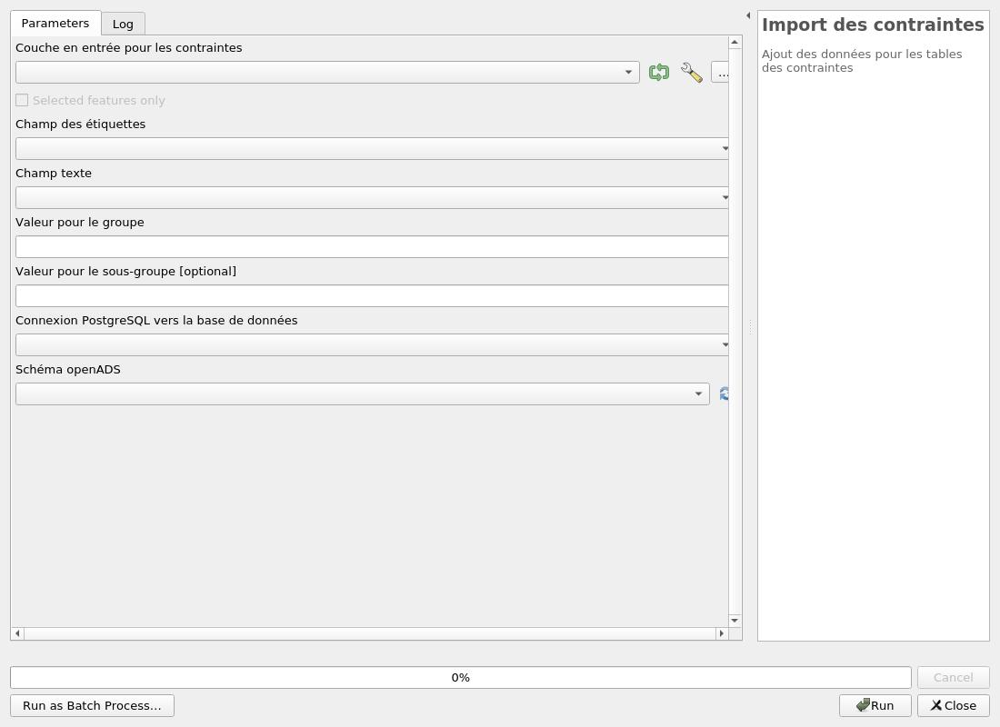
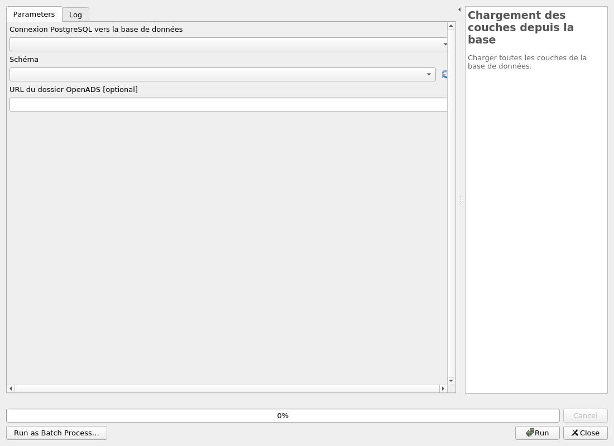

# Configuration

Il est nécessaire de suivre les étapes dans l'ordre afin de configurer le projet QGIS avec succès.

## Liste des scripts

Voici les différents scripts présents dans le plugin accessible via la boîte à outils.

## Structuration de la base de données

### Installation de la base

Vous allez utiliser ce script principalement lors de la première utilisation du plugin dans un nouveau projet
openads.
Il permet de mettre en place la structure de la base de données.

Assurez-vous d'avoir au préalable créé une connexion vers votre base de données dans QGIS. Pour cette première
phase on utilise l'algorithme `Installation de la base de données` présent dans l'onglet `Base de données`.

Le script dispose de trois paramètres qui sont :

* La connexion à la base de données
* La projection pour la base de données
* Si vous voulez écraser le schéma et donc repartir de zéro

## Mise en place des données

### Import des données

Le plugin dispose de trois scripts pour l'import des données. Les deux premiers permettent de mettre
en place les données pour les couches `communes` et `parcelles` à partir des données cadastre.

Ces deux scripts possèdent les mêmes paramètres :

* La connexion à la base de données
* Le schéma dans la base concernant les données cadastre
* Le schéma dans la base concernant les données openads
* Case à cocher de mise à jour de la table obligatoire pour lancer l'import
* Case à cocher pour importer la couche dans QGIS après la mise à jour de la table

Le troisième script d'import concerne la couche `contraintes`.

Il dispose de paramètres supplémentaires aux deux autres :

* Choix de la couche de contraintes à importer
* Choix du champ correspondant au `libellé`
* Choix du champ `texte`
* Définition de la valeur du champ `groupe`
* Définition de la valeur du champ `sous-groupe`
* Choix de la connexion à la base de données
* Choix du schéma des données `openads`

### Import des couches dans le projet QGIS

Maintenant que la base de données en place, il y a le script suivant qui permet d'importer toutes
les couches nécessaires au projet openads. Il importera les couches `communes`, `parcelles`,
`dossiers_openads` et la couche `contraintes`.

Il ne dispose uniquement que de deux paramètres :

* La connexion à la base de données
* Le schéma dans la base concernant les données openads
