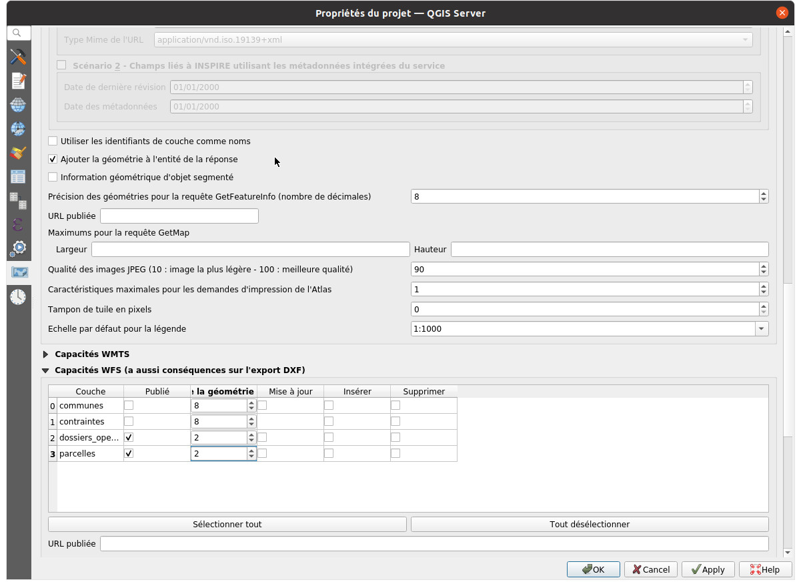
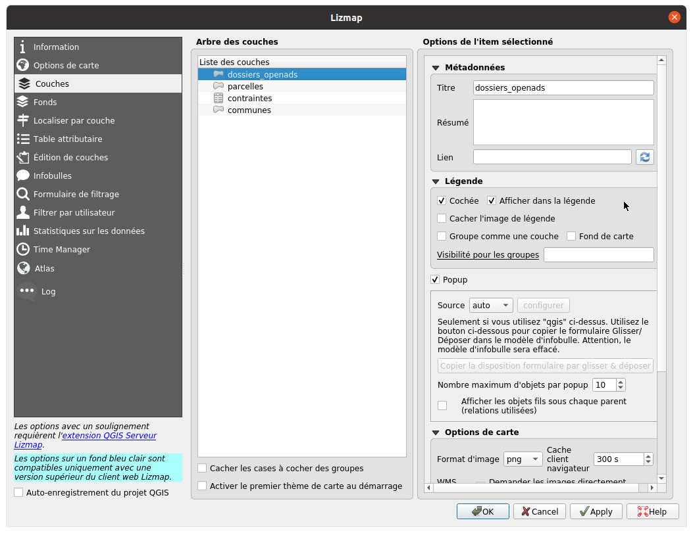
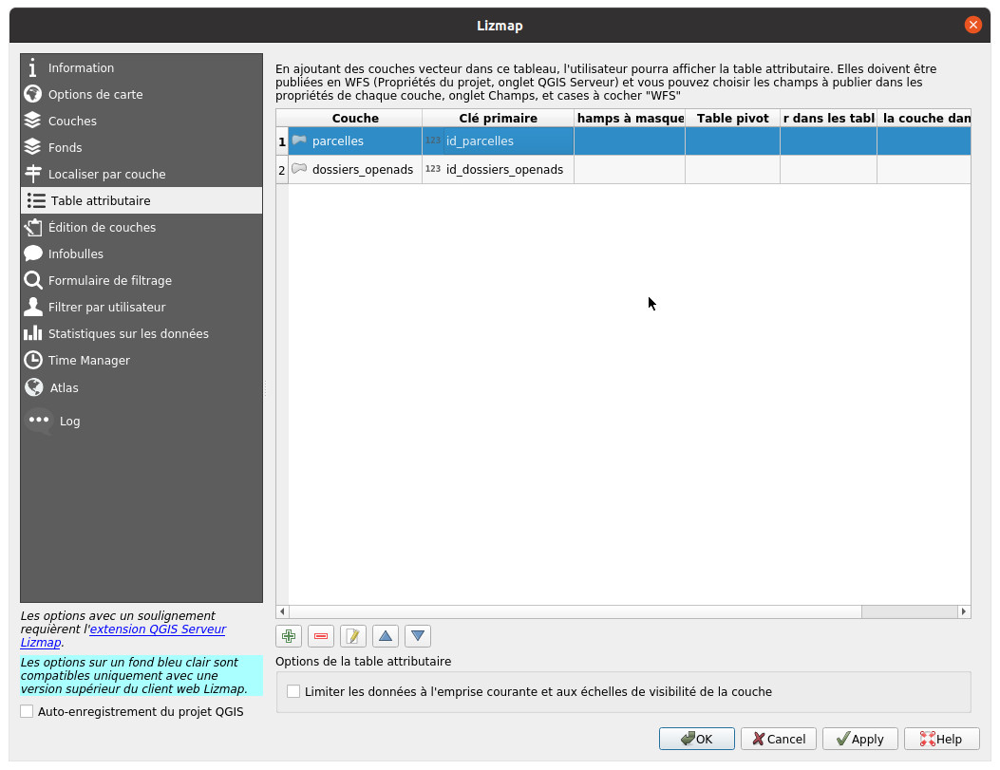
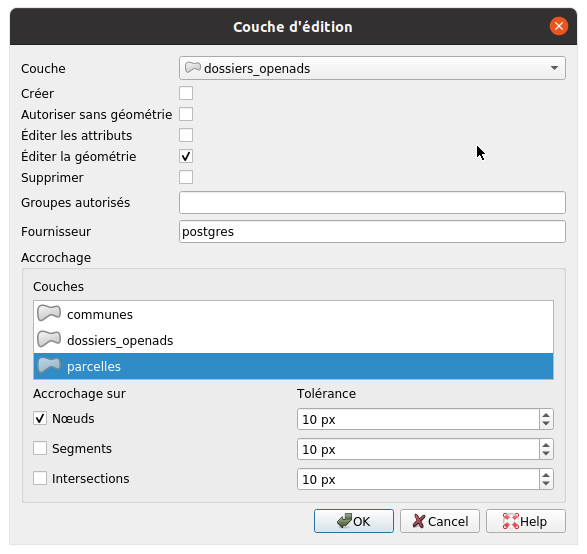

# Publication Lizmap

## Pré-requis

Avant de publier un projet OpenADS pour Lizmap, il est nécessaire d'avoir :

* installer le module OpenADS pour lizmap qui nécessite Lizmap Web Client 3.5.0 minimum
* suivi [les étapes de configuration](./configuration.md) :
  * [Structuration de la base de données](./configuration.md#structuration-de-la-base-de-données)
  * [Mise en place des données](./configuration.md#mise-en-place-des-données)
  * [Chargement des couches depuis la base de données](./configuration.md#chargement-des-couches-depuis-la-base-de-données)

## Configuration pour Lizmap et le module OpenADS

Vous devez donc disposer d'un projet QGIS `openads.qgs` contenant les couches `communes`, `parcelles`, `dossiers_openads` et la table `contraintes`.

Pour que le connecteur OpenADS / Lizmap fonctionne, il est nécessaire que :
* le projet se nomme **openads.qgs**
* les couches **communes**, **parcelles**, **dossiers_openads** et **contraintes** ne soient pas renommées

### Propriétés du projet QGIS

Il est nécessaire de publier en WFS les couches **parcelles** et **dossiers_openads**.

Il peut-être intéressant de cocher la case `Ajouter la géométrie à l'entité de la réponse` afin d'afficher les géométries associées aux popups lizmap.

### Configuration Lizmap

#### Couches

* Cocher la case `Cochée` pour les couches **communes**, **parcelles** et **dossiers_openads**
* Cocher la case `Popup` pour les couches **parcelles** et **dossiers_openads**

Vous pouvez modifier le titre et la mise en forme de la popup.

#### Table attributaire

Vous devez configurer les couches **parcelles** et **dossiers_openads** pour l'outil `Table attributaire` de lizmap.
Cette configuration est nécessaire afin de bénéficier de la fonction de **sélection** de Lizmap.

Vous pouvez adapater la configuration en fonction du volume de données publiées.

#### Édition de couches

La couche **dossiers_openads** doit-être configurer afin d'être éditable dans Lizmap.

Cette configuration permettra d'éditer l'emprise d'un dossier.

## Publication et configuration OpenADS

Une fois le projet QGIS `openads.qgs` et sa configuration lizmap `openads.qgs.cfg` prête, vous pouvez publier ces fichiers dans un répertoire Lizmap.
Ce répertoire peut très bien avoir un accès restreint par login et mot de passe.

Si vous avez publier votre projet QGIS `openads.qgs` et sa configuration lizmap `openads.qgs.cfg` dans le dossier `repertoire1` de votre serveur, que
l'url de votre instance lizmap est `demo.lizmap.com/lizmap` et que ce dossier a été configurer dans le backoffice de lizmap avec l'identifiant `rep1` 
et le titre `Répertoire principal` alors le projet sera accessible avec l'URL de la forme **demo.lizmap.com/lizmap**/index.php/view/map/?repository=**rep1**&project=openads

Pour la configuration du logicile OpenADS, il est nécessaire de fournir 2 URLs :

* Le lien URL_SIG qui est de la forme **demo.lizmap.com/lizmap**/index.php/view/map/?repository=**rep1**&project=openads
* Le lien BASE_URL qui est de la forme **demo.lizmap.com/lizmap**/openads.php/service/**rep1**~openads/

Vous devez adapter les 2 URLs en fonction :

* de l'URL d'accès à votre instance Lizmap
* de l'identifiant du répertoire au sein du quel le projet QGIS `openads.qgs` et sa configuration lizmap `openads.qgs.cfg` ont été publiés
